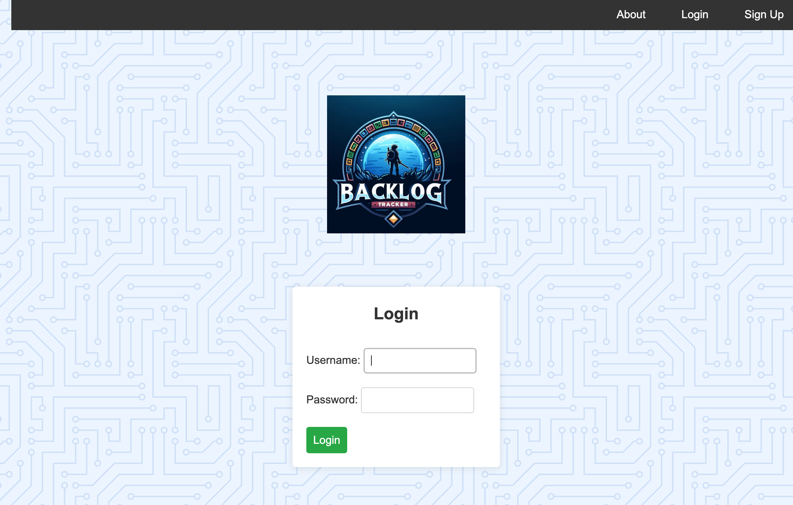

[Launch App](https://game-backlog-tracker-90ad5c8497e5.herokuapp.com)

# Backlog Tracker
A simple and easy way to track those pesky backlogged games you can't even remember buying.

## How to Use
1. Create an account
2. Sign In
3. Add a new game
    1. Edit and Delete your games

## Technologies Used

## Credits
[Hero Patterns](https://heropatterns.com)

[Favicon](https://icons8.com/icons/set/favicon-game)

All images generated by DALL·E 3

## Stretch Goals
* Add custom user uploaded images